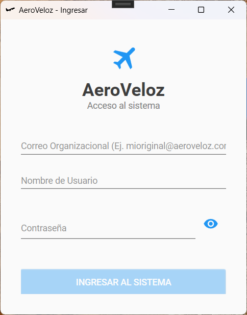
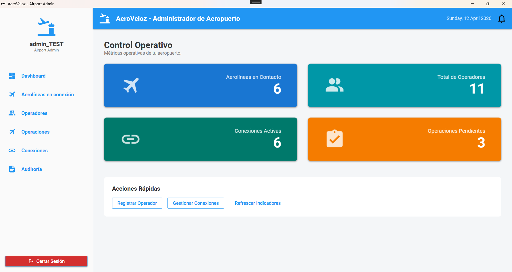

# AeroVeloz - Flight Management System

> **A comprehensive real-time flight management and monitoring platform for airports and airlines**

<div align="center">


</div>

---

## 📋 Table of Contents

- [Overview](#-overview)
- [Key Features](#-key-features)
- [System Architecture](#-system-architecture)
- [Requirements](#-requirements)
- [Installation & Setup](#-installation--setup)
- [Configuration](#-configuration)
- [Screenshots](#-screenshots)
- [Project Structure](#-project-structure)
- [Technologies](#-technologies)
- [Documentation](#-documentation)
- [Support & Contribution](#-support--contribution)

---

## 🎯 Overview

**AeroVeloz** is an enterprise-grade Flight Management System designed for airports and airline operators. It provides real-time flight information management, operational monitoring, user authentication, and comprehensive audit trails. The platform enables airport administrators to manage connections between airlines and airports, track flight operations, and maintain system integrity through advanced logging and event-driven architecture.

### Core Capabilities

- 🛫 **Real-time Flight Monitoring** - Track flights from multiple airlines with live status updates
- 👥 **Multi-role User Management** - Support for Super Admin, Airport Admin, and system operators
- 🔌 **Airline-Airport Connections** - Manage and configure airline operations at specific airports
- 📊 **Operational Management** - Monitor and manage flight operations, gates, and status changes
- 📝 **Comprehensive Audit Logging** - Immutable audit trails for compliance and security
- 🔔 **Real-time Notifications** - Push notifications via multiple channels (Email, SMS, Push)
- 🔐 **Enterprise Security** - JWT authentication, role-based access control, and event logging
- 📈 **System Analytics** - Dashboard with operational statistics and system health monitoring

---

## ✨ Key Features

### User Management & Authentication
- **Multi-level Role System**: Super Admin, Airport Admin, Airline Operator, System User
- **JWT-based Authentication**: Secure token-based access with refresh mechanisms
- **Account Security**: Login attempt tracking, account locking, and password management
- **Real-time Activity Monitoring**: Track user sessions and activities

### Flight Management
- **Flight Tracking**: Monitor flights in real-time across multiple airlines
- **Flight History**: Complete flight audit trail with status changes
- **State Management**: Comprehensive flight states (Scheduled, Boarding, Delayed, Cancelled, Completed)
- **Multi-airline Support**: Manage flights from various airline partners

### Operational Control
- **Operation Management**: Track operational changes and status updates
- **Door & Gate Management**: Control gate assignments and operational flow
- **Change Auditing**: Every operational change is logged with timestamp and user information
- **Alert System**: Automatic notifications for critical operational changes

### Audit & Compliance
- **Immutable Audit Logs**: Comprehensive logging of all system activities
- **Audit Detail Reports**: Drill-down into specific user activities and system changes
- **Compliance Tracking**: User action tracking with timestamps and change details
- **Deletion Prevention**: Audit records cannot be deleted, only marked

### Notification System
- **Multi-Channel Support**: Email, SMS, Push notifications
- **Event-Driven**: Real-time notifications for critical system events
- **User Subscriptions**: Granular control over notification preferences
- **Integration Ready**: Extensible provider system for custom notification channels

### Dashboard & Analytics
- **System Dashboard**: Overall system health and statistics
- **Airport-specific Dashboard**: Localized operational metrics
- **Real-time Stats**: Flight counts, operational metrics, user activity
- **Admin Reports**: Comprehensive system and operational reports

---

## 🏗️ System Architecture

AeroVeloz follows a **Clean Architecture** pattern with clear separation of concerns:

```
┌─────────────────────────────────────────────────┐
│         Presentation Layer (WPF Desktop)        │
├─────────────────────────────────────────────────┤
│    Application Layer (Services & Use Cases)     │
├─────────────────────────────────────────────────┤
│   Domain Layer (Entities, Domain Logic, Rules)  │
├─────────────────────────────────────────────────┤
│  Infrastructure Layer (Data, External Services) │
└─────────────────────────────────────────────────┘
```

**Core Layers:**
- **Domain**: Pure business logic, entities, and domain events
- **Application**: Services, DTOs, repositories, and orchestration
- **Infrastructure**: Database access, external services, and implementations
- **Presentation**: WPF Desktop UI with MVVM pattern
- **API**: REST API service for integration
- **IoC**: Dependency Injection configuration

**Architecture Patterns:**
- **Clean Architecture**: Organized into clearly defined layers
- **CQRS**: Command and Query Responsibility Segregation with MediatR
- **Event-Driven**: Domain events trigger application-level processing
- **Repository Pattern**: Abstraction over data access
- **Validator Pattern**: Business rule validation at domain level

> 📚 For detailed architecture documentation, see [Architecture Guide](./docs/ARCHITECTURE.md)

---

## 📋 Requirements

### System Requirements
- **OS**: Windows 10 (Build 19041) or later
- **Runtime**: .NET 9.0 or higher
- **Memory**: Minimum 4GB RAM (8GB recommended)
- **Storage**: 2GB free disk space

### Software Requirements
- **IDE**: Visual Studio 2022 (Community Edition or higher)
- **Database**: SQL Server 2019 or later
- **Frameworks**: .NET 9.0 SDK
- **Package Manager**: NuGet 6.0+

### Development Prerequisites
- C# 12.0 or higher
- WPF (Windows Presentation Foundation)
- Entity Framework Core 9.0
- MediatR (CQRS implementation)
- Windows SDK (10.0.19041.0)

---

## 🚀 Installation & Setup

### Quick Start

#### 1. **Prerequisites Installation**
```powershell
# Install .NET 9 SDK (if not already installed)
# Download from: https://dotnet.microsoft.com/download

# Verify installation
dotnet --version
```

#### 2. **Clone the Repository**
```bash
git clone https://github.com/JoelZhub/AeroVeloz.git
cd AeroVeloz
```

#### 3. **Restore Dependencies**
```bash
dotnet restore
```

#### 4. **Database Configuration**
```bash
# Update connection string in appsettings.json
# Configure your SQL Server connection
```

#### 5. **Build the Project**
```bash
dotnet build
```

#### 6. **Run the Application**
```bash
cd Presentacion/AeroVeloz.Desktop
dotnet run
```

> 📖 For detailed setup instructions, see [Environment Setup & Installation Guide](./docs/ENVIRONMENT_SETUP_AND_INSTALLATION_GUIDE.md)

---

## ⚙️ Configuration

### Essential Configuration Steps

#### 1. **Database Connection String**
Update `appsettings.json` in the Infrastructure project:
```json
{
  "ConnectionStrings": {
    "DefaultConnection": "Server=YOUR_SERVER;Database=AeroVelozDB;Integrated Security=true;TrustServerCertificate=true;"
  }
}
```

#### 2. **User Secrets**
Store sensitive data using .NET User Secrets:
```bash
# Initialize user secrets (in Presentacion/AeroVeloz.Desktop directory)
dotnet user-secrets init

# Set JWT secret
dotnet user-secrets set "JwtSettings:SecretKey" "your-super-secret-key-minimum-32-characters"

# Set API connection
dotnet user-secrets set "ApiSettings:BaseUrl" "http://localhost:5000"
```

#### 3. **JWT Configuration**
Configure JWT authentication settings:
```json
{
  "JwtSettings": {
    "SecretKey": "your-secret-key-here",
    "Issuer": "AeroVeloz",
    "Audience": "AeroVelozClient",
    "ExpirationMinutes": 60
  }
}
```

#### 4. **Notification Providers**
Configure your notification channels:
```json
{
  "NotificationSettings": {
    "EmailProvider": {
      "Enabled": true,
      "SmtpServer": "smtp.gmail.com",
      "Port": 587
    },
    "SmsProvider": {
      "Enabled": true,
      "ApiKey": "your-sms-api-key"
    }
  }
}
```

---

## 📸 Screenshots

### Login Interface


**Description:** Secure authentication interface with role-based access control.

---

### System Administrator Dashboard


**Description:** Global system overview with comprehensive statistics and metrics for Super Administrators.

---

### Airport Administrator Dashboard


**Description:** Airport-specific operational dashboard showing local flight management and statistics.

---

### User Management


**Description:** Administrative interface for managing users, airports, and organizational settings.

---

### Operational Management


**Description:** Control panel for managing flight operations, gates, and status changes in real-time.

---

### Flight Operations Monitoring


**Description:** Detailed view of airport operations with flight tracking and status monitoring.

---

### Airline Connection Management


**Description:** Interface for configuring and managing airline connections at specific airports.

---

### Advanced Airline Connection Settings


**Description:** Detailed configuration options for airline-airport connections.

---

### Operation Detail Information


**Description:** Comprehensive details view for individual flight operations with change history.

---

### Notification System


**Description:** Real-time notification center showing system events and operational changes.

---

### Audit Logs - Global View


**Description:** Complete system audit trail viewable by Super Administrators for compliance and security.

---

### Audit Logs - Airport Admin View


**Description:** Airport-specific audit logs showing all operational changes and user activities.

---

### Detailed Audit Records


**Description:** In-depth audit information for specific user actions and operational changes.

---

## 📁 Project Structure

```
AeroVeloz/
├── Core/
│   ├── AeroVeloz.Domain/              # Pure business logic and entities
│   │   ├── Entities/                  # Domain entities
│   │   ├── Events/                    # Domain events
│   │   ├── DomainServices/            # Domain-level services
│   │   ├── Validators/                # Business rule validators
│   │   └── Common/                    # Shared domain utilities
│   │
│   └── AeroVeloz.Application/         # Use cases and orchestration
│       ├── Services/                  # Business logic services
│       ├── DTOs/                      # Data transfer objects
│       ├── Repositories/              # Data access abstractions
│       ├── Contracts/                 # Service interfaces
│       └── EventServices/             # Event handlers
│
├── Infraestructure/
│   └── AeroVeloz.Infraestructure/    # Database and external services
│       ├── Persistence/               # EF Core DbContext
│       ├── Repositories/              # Repository implementations
│       └── Services/                  # External service integrations
│
├── Presentacion/
│   └── AeroVeloz.Desktop/            # WPF Desktop Application
│       ├── Views/                     # XAML UI components
│       ├── ViewModels/                # MVVM ViewModels
│       ├── Services/                  # UI services
│       └── Resources/                 # UI resources and styles
│
├── Api/
│   └── AeroVelozDesktop.Api/         # REST API Service
│       └── Controllers/               # API endpoints
│
├── IOC/
│   └── AeroVeloz.IOC/                # Dependency injection configuration
│
├── Transversal/
│   └── AeroVeloz.Transversal/        # Cross-cutting concerns
│       └── Logging/                   # Logging utilities
│
├── Screenshots/                        # Application screenshots
├── docs/                              # Documentation
├── README.md                          # This file
└── LICENSE                            # MIT License
```

---

## 🛠️ Technologies

### Backend Framework & Languages
- **.NET 9.0** - Latest stable framework
- **C# 12.0** - Modern language features
- **Entity Framework Core 9.0** - ORM for database access
- **MediatR** - CQRS implementation

### Desktop UI
- **WPF** (Windows Presentation Foundation) - Desktop UI framework
- **MVVM Toolkit** - Community Toolkit for MVVM pattern
- **Material Design** - Modern UI design system

### Authentication & Security
- **JWT** (JSON Web Tokens) - Token-based authentication
- **SignalR** - Real-time communication

### Additional Libraries
- **MediatR 13.1.0** - Command/Query bus
- **Microsoft.Extensions.Hosting** - Application host
- **Microsoft.Toolkit.Uwp.Notifications** - Windows notifications

---

## 📚 Documentation

This project includes comprehensive documentation:

| Document | Purpose |
|----------|---------|
| [**ARCHITECTURE.md**](./docs/ARCHITECTURE.md) | Detailed system architecture, design patterns, and technical decisions |
| [**ENVIRONMENT_SETUP_AND_INSTALLATION_GUIDE.md**](./docs/ENVIRONMENT_SETUP_AND_INSTALLATION_GUIDE.md) | Step-by-step setup, configuration, and deployment instructions |
| **README.md** | Project overview and quick reference |

---

## 🤝 Support & Contribution

### Getting Help
- 📖 Review the [Architecture Guide](docs/ARCHITECTURE.md) for technical details
- 🚀 Check the [Setup Guide](docs/ENVIRONMENT_SETUP_AND_INSTALLATION_GUIDE.md) for installation issues
- 💬 Open an issue on GitHub for bug reports

### Contributing
Contributions are welcome! Please ensure:
- Code follows the existing style and patterns
- All changes include appropriate documentation
- Tests pass before submitting

### Project Information
- **Repository**: https://github.com/JoelZhub/AeroVeloz
- **Branch**: app-desktop
- **License**: MIT
- **Status**: Active Development

---

## 📄 License

This project is licensed under the MIT License - see the [LICENSE](LICENSE) file for details.

---

<div align="center">

**Built with ❤️ for Flight Management Excellence**

*AeroVeloz - Real-time Airport Operations Management*

</div>
