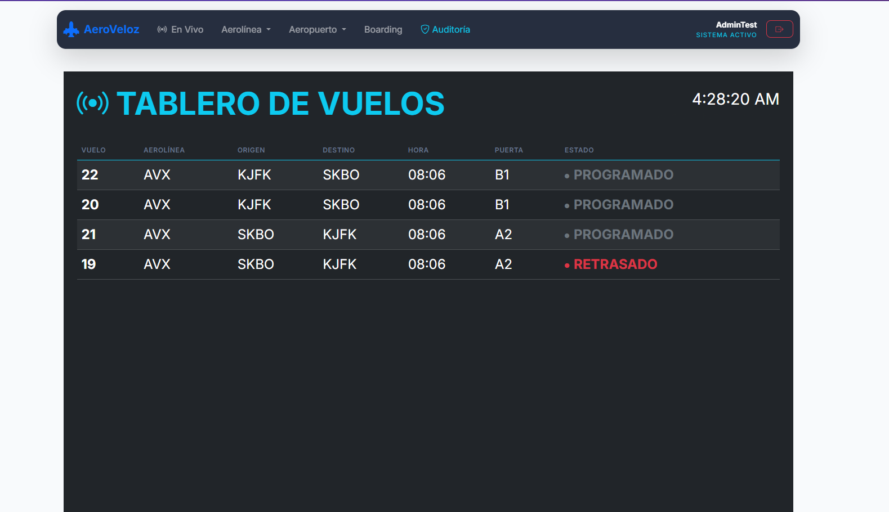
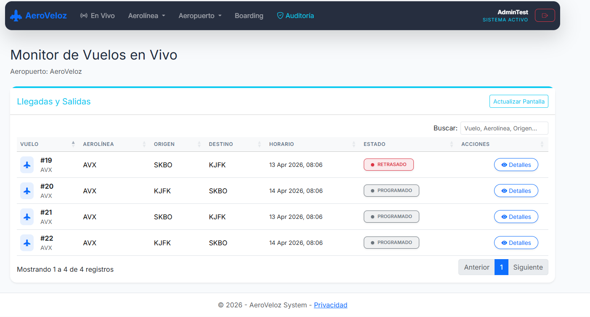
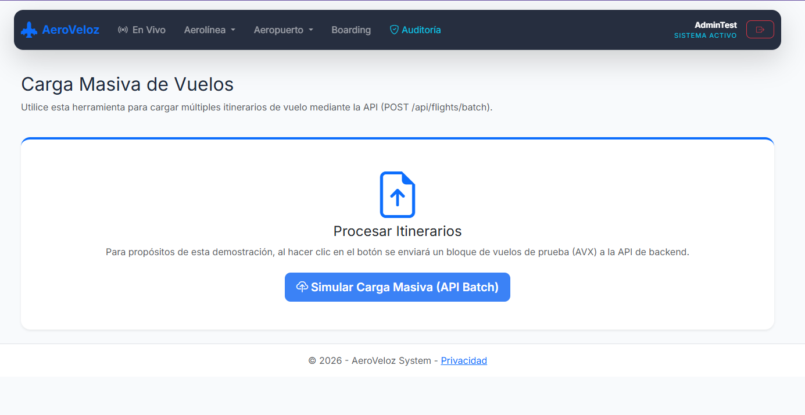
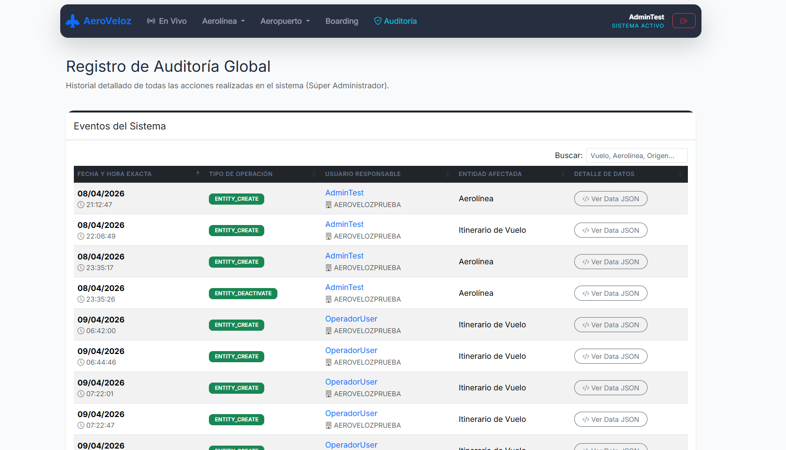
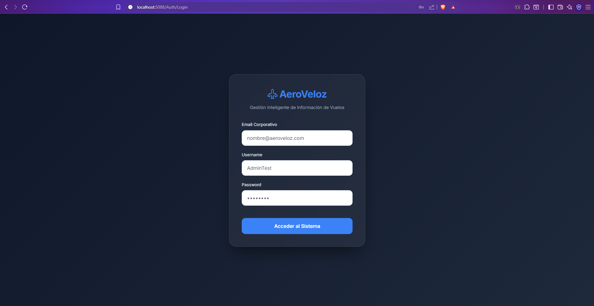
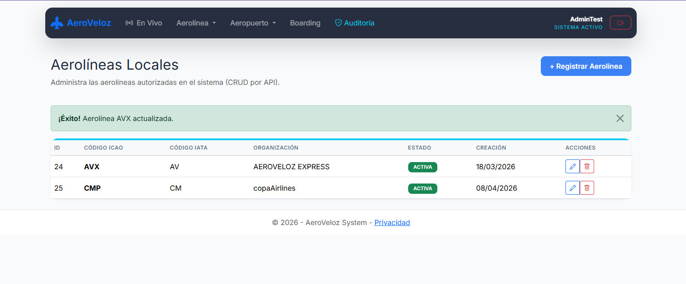
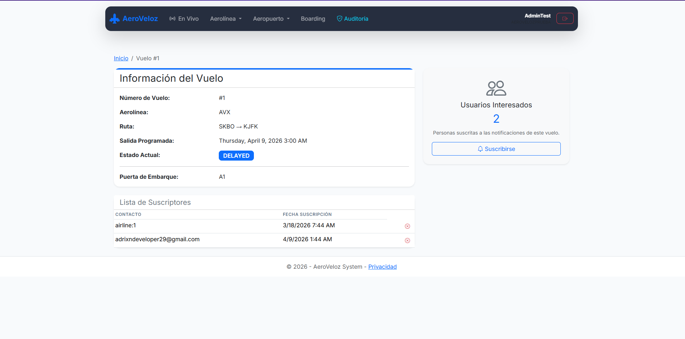

# AeroVeloz 🛫


**AeroVeloz** is a modern, scalable, and highly available **Flight Information Management System**. It enables real-time monitoring of flights from multiple airlines, providing up-to-date information through dedicated applications for passengers, airlines, and airport operators.

This project was built using **.NET 9** following **Clean Architecture (Onion Architecture)**, **Domain-Driven Design (DDD)**, and **CQRS** patterns to ensure maximum maintainability, testability, and separation of concerns.

---

## 📸 System UI Preview

*(Note: Place your images in a folder named `gallery` in the root of the project to see them here)*

| Public Live Board (Passengers) | Operations Boarding (Airport Staff) |
| :---: | :---: |
|  |  |
| A real-time public screen displaying active flights, statuses, and boarding gates. | A specialized dashboard for airport operators to manage flights for their specific location. |

| Airline Admin Dashboard | Super Admin System (Audit) |
| :---: | :---: |
|  |  |

### 🛠️ More Views
| Secure Login Access | Airline Management | Flight Details |
| :---: | :---: | :---: |
|  |  |  |
| Encrypted authentication gateway. | Validating and managing airline records. | In-depth flight information and tracking. |

---

## ✨ Key Features

- **Real-Time Flight Monitoring:** Public boards and private dashboards with active heuristic filtering (automatically hiding old flights).
- **Multi-Tenant System:** Secure role-based access control (RBAC) supporting System Admins, Airport Admins, Airline Admins, and Operators.
- **Flight Batch Uploading:** Efficiently insert multiple flights using automated processes.
- **Audit Logging & Monitoring:** Full traceability of system actions (CREATE, UPDATE, DELETE) using custom auditing mechanisms.
- **Subscription Engine:** Notification channels (Email, SMS, Push) for flight updates (Architecture prepared).
- **Global Error Handling & Logging:** Centralized resilience mechanisms.

---

## 📂 Documentation

For a deep dive into the system's technical details, refer to the following documentation files:

*   [Architecture & Design Principles](docs/ARCHITECTURE.md) - Explains Clean Architecture, DDD, and Layers.
*   [Environment Setup & Installation](docs/ENVIRONMENT_SETUP.md) - Step-by-step guide to run the project.

---

## 🚀 Quick Start Guide

### 1. Prerequisites
- [.NET 9.0 SDK](https://dotnet.microsoft.com/download/dotnet/9.0)
- SQL Server (LocalDB or Docker instance)
- Visual Studio 2022 (latest version) or JetBrains Rider

### 2. Clone and Setup
```bash
git clone https://github.com/your-username/AeroVeloz.git
cd AeroVeloz
```

### 3. User Secrets (Secure Configuration)
This project uses `.NET User Secrets` to avoid exposing sensitive keys in source control. Run these commands inside the `Api\AeroVeloz.Api` directory:

```bash
# Set your LocalDB connection string
dotnet user-secrets set "ConnectionStrings:DefaultConnection" "Server=(localdb)\MSSQLLocalDB;Database=AeroVeloz;Trusted_Connection=True;TrustServerCertificate=True"

# Optional: Set external API keys (if applicable)
dotnet user-secrets set "AirLabs:ApiKey" "your-secret-key"
```

### 4. Database Initialization
Navigate to the `Infraestructure\AeroVeloz.Infraestructure` directory and run the Entity Framework Core migrations to seed the database with required Roles, Permissions, and the Admin Organization:

```bash
dotnet ef database update --startup-project ../../Api/AeroVeloz.Api
```

### 5. Run the Application
Start both the **Backend API** and the **Web Frontend**.

1. Run the API (`AeroVeloz.Api`):
   ```bash
   dotnet run --project Api/AeroVeloz.Api
   ```
2. Run the Web App (`AeroVeloz.Web`):
   ```bash
   dotnet run --project Presentacion/AeroVeloz.Web
   ```

### 6. Initial Login
Once the system is running, access the web portal at `https://localhost:7001` (or the port defined in your `launchSettings.json`).

*   **Email Corporativo:** `Admin@Aeroveloz.com`
*   **Username:** `AdminTest`
*   **Password:** `Admin123!`

---

## 🛡️ License

This project is licensed under the terms described in the [LICENSE](LICENSE) file.
